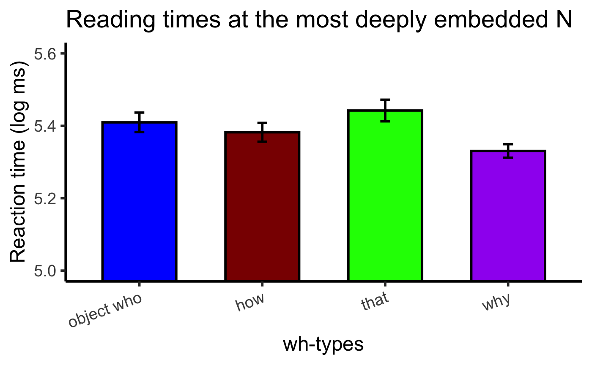
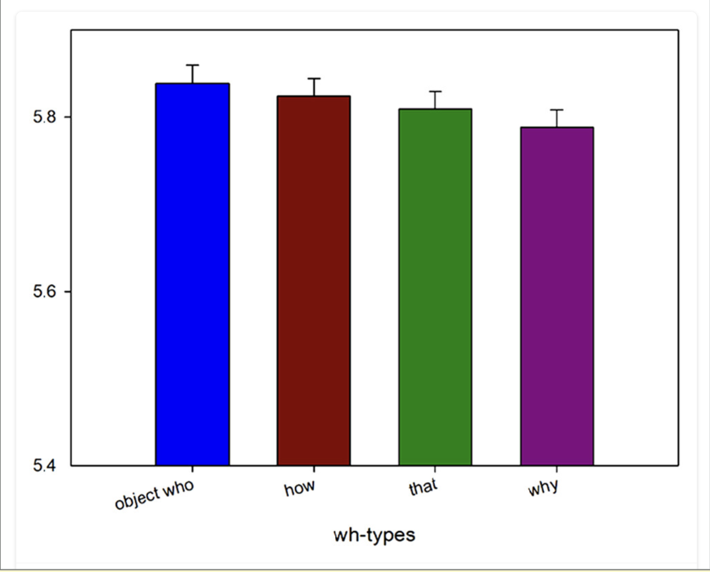
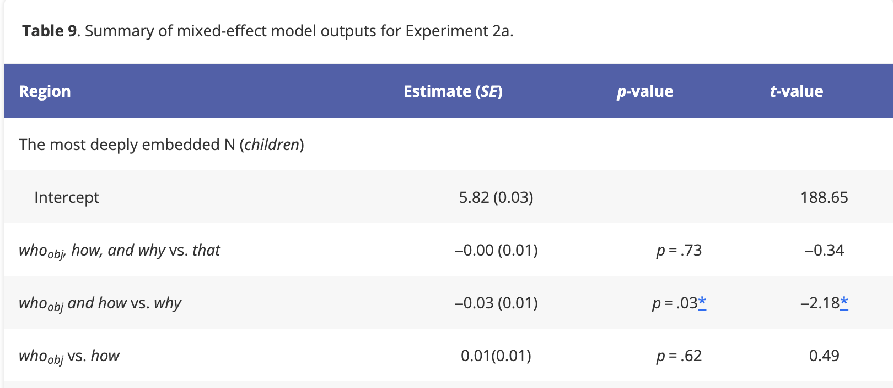
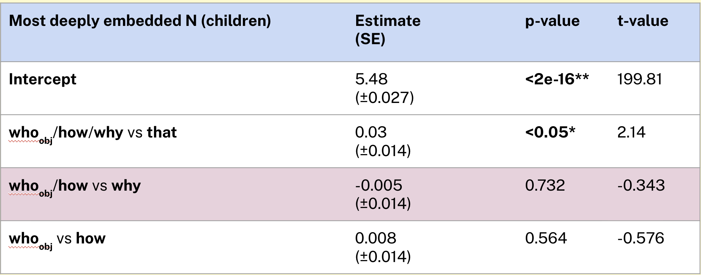
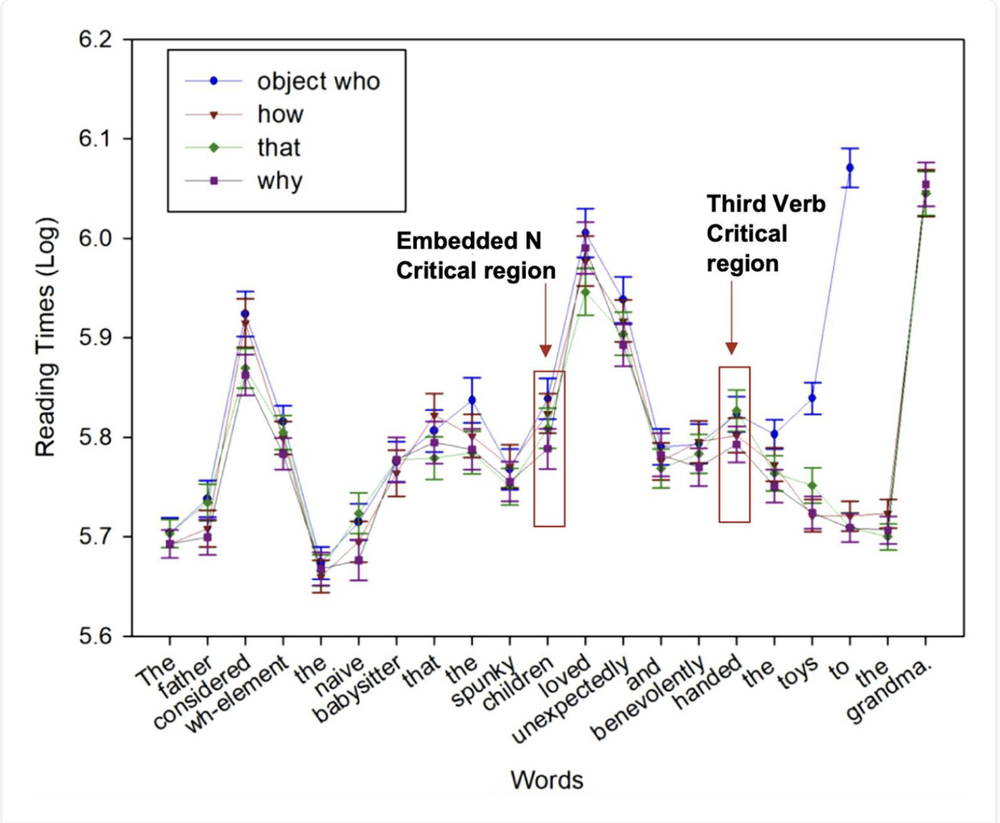

## Introduction

Kim et al. (2024) present experimental evidence that different _wh_-filler-gap dependencies are associated with different processing costs during comprehension. More specifically, the experimenters presented Northwestern university students (n=64) with self-paced reading tasks of various _wh_-filler-gap dependencies, finding that dependencies with longer filler-gap dependencies (e.g. _who~obj~_, _how_) are associated with longer reading times than those with shorter filler-gap dependencies (e.g. _that_~, _why_). They take these findings to be direct consequences of Gibson's (1998) Dependency Locality Theory, in which the length of a filler-gap dependency predicts processing costs in both storage and integration.

This study replicates Experiment 2a of Kim et al. (2024), which contained a set of stimuli with two embedded relative clauses within the _wh_-dependency. Both the procedure and stimuli from Experiment 2a are directly copied. In doing this replication study, we're specifically looking for whether, at the most deeply embedded N in the stimulus sentence, the _who~obj~_ and _how_ dependencies will be associated with longer reading times than the _why_ and _that_ dependencies.

## Methods

Given Kim et al.'s (2024) original estimate 0.03 (SD = 0.01) with n = 64, we would need a sample size of n=56 for 80% power, n=75 for 90% power, and n=93 for 95% power. 

### Planned Sample

80 participants, sampled from Prolific.

### Materials

Stimuli consisted of 24 sentences for each _wh_-type (_who~obj~_, _how_, _why_, _that_), as well as 74 filler sentences.

An example of one of the sentences is shown in (1). Bolded is the _wh_-word (_who~obj~_), and italicized is the word at which reading time is measured (_children_, the deepest N in the sentence).

1. The father considered *who* the naive babysitter that the spunky _children_ loved unexpectedly and benevolently handed the toys to __.

### Procedure	

We follow the experimental procedure directly from Kim et al. (2024), as quoted below:

"Stimuli were presented on a desktop PC using Linger software (Rohde, 2003) employing a self-paced word-by-word moving window paradigm (Just et al., 1982). Each experimental trial was initiated with dashes that masked words in the sentence. As participants pressed a button to move forward, each subsequent word appeared. Participants were instructed to read the sentences as they would normally read and to answer a comprehension question after reading each sentence. The yes/no comprehension question asked participants to press the F (yes) or J (no) keys. An example of a comprehension question is, Was the word “toys” mentioned in the story?. After receiving feedback on their responses, participants pressed the spacebar to proceed to the next experimental item. Six practice items were presented at the beginning of the experiment to allow participants to grasp the experimental format. The experiment took each participant approximately 30–45 mins to complete."

### Analysis Plan

We also follow the analysis plan of Kim et al. (2024):

"Data were analysed using linear mixed-effect regression models performed with the lme4 package in R version 3.2.3 (Baayen, 2008; Baayen et al., 2008; Bates et al., 2014). Each model included Helmert coding, where at the deeply embedded N, we compared (a) _who~obj~_, _how_, _why_ with _that_ as a baseline; (b) who~obj~ and _how_ with _why_; and (c) _who~obj~_ with _how_. At the adverb before the third verb and the third verb region, we compared (a) _who~obj~_, _how_, _why_ with that as a baseline; (b) _who~obj~_ with _how_ and _why_ and (c) _why_ with _how_. At this region, we compared _who~obj~_ with _how_ and _why_ because the adverb already signals the introduction to the VP at which _how_ should be integrated. Thus, we expected _how_ and _why_ to be read similarly unlike who~obj~ which induces storage costs. All models contained the maximal random effects structure that fit the data (Barr et al., 2013), including random intercepts for participants and items, and random slopes for fixed effects if the model successfully converged. In cases where the model did not converge, random effects containing the smallest variance were removed in a step-wise manner. Participants with an accuracy lower than 68% were excluded (Kim et al., 2019, 2020).
The reading times were log-transformed (Box & Cox, 1964). Two regions of interest were identified in this study. The first critical region was the most deeply embedded N (embedded N critical region: children in Table 8) where the processing complexity due to storage was expected to be the highest. We were also interested in one word following the most deeply embedded N critical region (embedded N spill-over region), given that effects arising in the critical region often spill over to one region following, that is, the spill-over region (Mitchell, 1984, 2018; Vasishth, 2006). The second critical region was the adverb region before the third verb, the third verb (e.g., benevolently and handed in Table 8) and the word following it (third verb spill-over region)."

**Key feature of interest**: effect size on reading time in reading a _who~obj~_ or _how_ dependency over a _that_ or _why_ dependency at the most deeply embedded N 

### Differences from Original Study

The primary difference from the original study is the sample, which we will collect from Prolific. This should not be associated with a different prediction.

### Pilot A Results

Below are the reading times at the most deeply embedded N across _wh_-types -- i.e. Kim et al.'s (2024) main variable of interest.




### Methods Addendum (Post Data Collection)

#### Actual Sample
The sample consisted of 70 partipants recruited from Prolific. Of the 70 participants, 39 were female and 30 were male. The median age was 34.

#### Differences from pre-data collection methods plan
None

## Results

```{r include=F}

# Load packages
library(tidyverse)
library(pwr)        
library(emmeans)
library(lme4)
library(lmerTest)
theme_set(theme_minimal())

# Import data from Prolific

files <- c(
  c(
    "0j17p08k.csv", "1dg2qhj2b3.csv", "1e17ytgq.csv", "1fqrd6qr.csv", "1lmu0rmy.csv", "1orqqvyp.csv",
    "1qr6nnt1.csv", "1sftbbwm.csv", "2bomnjjb.csv", "2ea7uxyc.csv", "2ewef3gm.csv","2odgntx7.csv","3e3v39z8.csv","3jtr11xk.csv","3og97j2k.csv","3ut1qsdd.csv","4gjn1seg.csv","4qcemy4k.csv","4yxop4r3.csv","5lqc6nvcre.csv","5vrdpq0t.csv","7f2wtp1j.csv","7lhlpfus.csv","7mza4pym.csv","9kd8a7eb.csv","9nvsempv62.csv","20frs6ol.csv","31by1doq.csv","91mfkpae.csv","120ypmwg.csv","352jd0sb.csv","970gbe0a.csv","a7afpb9w.csv","adbunmf0.csv","ajl3gqra.csv","bn7akg4o.csv","bo3a253d.csv","bqlvmxzf.csv","c1m9yfql.csv","cktudb9s.csv","dsfc282a.csv","e34duc56.csv","el2hvftl.csv","gfzoatpu.csv","h8nlnku2.csv","h6253x9m.csv","hb3mv8ph.csv","hb4brkxq.csv","hs2xklzn.csv","hwsqhjot.csv","jrj7xzuf.csv","k2b5yzkl.csv","k8rnkquz.csv","kl8k8j1y.csv","lta397lq.csv","luzwjk24.csv","lwvpwcq0.csv","m1eabfx1.csv","n8adea4h.csv","na6hh0ua.csv","nflshhgq.csv","o92u56uh.csv","ogyjt8yg.csv","ojv4jxxa.csv","olol1tte.csv","orybxbxu.csv","p3taub1f.csv","pco9vqna.csv","pm5zycnt.csv","ppt63ukd.csv","q330tno2.csv","qbwjdear.csv","qfm8ks37.csv","qgzx1bfu.csv","r0pm70sc.csv","r1o8o6o4.csv","repvu995.csv","rxur173z.csv","s3j977x7.csv","szh4zjou.csv","tf6nb9bm.csv","tpt94g2b.csv","tw3k60gy.csv","txdtrb48.csv","u0pme1hk.csv","u1s85lkk.csv","u2fs8oqd.csv","ucyeq6mc.csv","uu3k1546.csv","vg74l3ea.csv","vgp86ou0.csv","vp4hn41a.csv","w3yqa2f3.csv","xthmgyn8.csv","y14x4t45.csv","yu3vjzn3.csv","z25ltc96.csv"
  )
)

# Read and combine all files from ../stims
data.raw <- files %>%
  set_names() %>%
  map_dfr(
    ~ suppressMessages(
        suppressWarnings(
          read_csv(
            file.path("data/pilotb", .x),
            show_col_types = FALSE
          ) %>%
          mutate(rt = as.numeric(rt))
        )
      ),
    .id = "source_file"
  )

# Import dem data
dem_data <- read.csv("data/pilot_b_demographic_data.csv")

# Clean up col names in dem_data
colnames(dem_data) <- c("submission_id", "participant_id", "status", "custom_study",
                        "started_at", "completed_at", "reviewed_at", "archived_at",
                        "time_taken", "completion_code", "total_approvals", "age",
                        "sex", "ethnicity", "birth_country", "residence_country",
                        "nationality", "language", "student", "employment")

dem_data <- dem_data %>%
  mutate(age = as.numeric(age))

stims.raw <- read.csv("stims/stims_abridged_all_info.csv")

#### Data exclusion / filtering
# Remove filler and practice entries
data <- data.raw %>%
  select(!stimulus) %>%
  left_join(dem_data %>% filter(status != "RETURNED") %>% select("participant_id", "age", "sex", "ethnicity", "birth_country",
                                "nationality", "language", "student", "employment"),
            by = join_by(subject_id == participant_id)) %>%
  left_join(stims.raw %>% select(item_id, target_word, stimulus), multiple = "first", by = join_by(item_id)) %>% # condition = _wh_-word used in sentence
  filter(condition == 'a' | word_index < 19) %>%
  filter(item_type != 'filler' & item_type != 'practice' & too_fast == FALSE) 

### Add columns
data <- data %>%
  mutate(rt = as.numeric(rt),
         log_rt = log(rt),
         whword = factor(ifelse(condition == 'a', 'object who', 
                         ifelse(condition == 'b', 'how',
                                ifelse(condition == 'c', 'that',
                                       'why'))), levels = c("object who", "how", "that", "why")),
         is_target_word = (target_word == word))

```

### Confirmatory analysis

#### Reading times at most deeply embedded N

First we replicate Kim et al.'s (2024) main finding (their Experiment 2a): namely that at the most deeply embedded NP, there is a clear asymmetry in reading times across _wh_-types, predicted by the structural height of the _wh_-element.


Kim et al.'s (2024) results are shown in the graph below. Here we see a clear descending hierarchy in _wh_-types, _who~obj~_ > _how_ > _that_ > _why_, which follows what generativist syntax predicts. 



By contrast, in our replication study, we do not find any clear descending hierarchy between the _wh_-types. 

```{r include=F}
# Compute mean reaction time per condition
agr <- data %>%
  filter(is_target_word) %>%
  group_by(whword) %>%
  summarise(n = n(), se = sd(log_rt) / sqrt(n()), y = mean(log_rt)) %>%
  mutate(
    whword = factor(
      whword,
      levels = c("object who", "how", "that", "why")
    ) )# Order whword elements to be object who, how, that, why
```

```{r}
agr %>%
  mutate(` ` = whword) %>%
  ggplot(aes(x = ` `, y = y, fill = ` `)) +
  geom_bar(stat = "identity", width = 0.6, linewidth = 1) +
  geom_errorbar(aes(ymin = y - se, ymax = y + se ),   
                width = 0.08,   linewidth = 1 ) +
  scale_fill_manual(values = c("object who" = "blue",
                               "how" = "#D55E00",
                               "that" = "darkgreen",
                               "why" = "magenta")) +
  coord_cartesian(ylim = c(5, 5.6)) +
  labs(x = "_wh_-types", y = "Reaction time (log ms)") +
  ggtitle("Reading times at the most deeply embedded N") +
  theme(
    legend.position = "none",
    axis.text.x = element_text(
      angle = 20,
      hjust = 1
    ),
    axis.line = element_line(linewidth = 1),
    axis.ticks = element_line(linewidth = 1)
  ) +
  theme_minimal()
```


While, in the original study, Kim et al. (2024) were unable to find significant effects between _individual_ _wh_-types, they do identify significant effects when clustering _wh_-types together, as shown in their Table 9:



```{r include = F}
# Testing the who_obj + how vs. why effect (reported significant)

data_no_that <- data %>%
  filter(is_target_word) %>%
  filter(whword != 'that') %>%
  mutate(is_why = ifelse((whword == 'why'), "why", "who_obj and how"))

model_2 <- lmer(
  log_rt ~ is_why + 
    (1 | participant_id) + 
    (1 | item_id),
  data = data_no_that
)

# View results
summary(model_2)
```

We, by contrast, do not find any significant effects when running a mixed-effect model.



#### Reading times at each word

Finally, we look at reading times at every word in the stimulus, rather than just the most deeply embedded N. Compared to the original study, we see that reading times across each word in the sentence follows roughly the same trajectory: there is one peak in the middle and one in the end. But the contrast between _wh_-types, which was already low in the original study, is virtually nonexistent in the replication.




```{r include=F}
agr <- data %>%
  group_by(word_index, whword) %>%
  summarise(y = mean(log_rt))
words <- c(
  "the",
  "father",
  "considered",
  "_wh_-element",
  "the",
  "naive",
  "babysitter",
  "that",
  "the",
  "spunky",
  "children",
  "loved",
  "unexpectedly",
  "and",
  "benevolently",
  "handed",
  "the",
  "toys",
  "to",
  "the",
  "grandma"
)
```

```{r}
agr %>% 
  mutate(` ` = whword) %>%
  ggplot(aes(x = word_index, y = y,
             color = ` `,
             group = ` `)) +
  geom_line(linewidth = 1, alpha = 0.7) +
  geom_point(size = 2, alpha = 0.7) +
  scale_color_manual(values = c("object who" = "blue",
                               "how" = "#D55E00",
                               "that" = "darkgreen",
                               "why" = "purple")) +
  theme(
    axis.text.x = element_text(
      angle = 90,
      vjust = 0.5,
      hjust = 1
    )
  ) +
  scale_x_continuous(
    breaks = seq_along(words) - 1,
    labels = words
  ) +
  ggtitle("Means of region-by-region reading times") +
  labs(x="Words", y="Mean reading time (log ms)")
```


### Exploratory analyses

To assess whether this failure of replication was due to a different sample demographic, we split the data by age, namely into two groups, age < 35 and age >= 35 (where 35 is the median age).

```{r include=F}
# Create dummy value (age < 35), where 35 is the median age

agr <- data %>%
  filter(!is.na(age)) %>%
  mutate(is_old = factor(ifelse(age < 35, "Younger than 35", "35 or older"),
                          levels = c("Younger than 35", "35 or older"))) %>%
  group_by(is_old, word_index, whword) %>%
  summarise(y = mean(log_rt))

```

```{r}
agr %>% 
  mutate(` ` = whword) %>%
  ggplot(aes(x = word_index, y = y,
             color = ` `,
             group = ` `)) +
  geom_line(linewidth = 1, alpha = 0.7) +
  geom_point(size = 2, alpha = 0.7) +
  scale_color_manual(values = c("object who" = "blue",
                               "how" = "#D55E00",
                               "that" = "darkgreen",
                               "why" = "purple")) +
  theme(
    axis.text.x = element_text(
      angle = 90,
      vjust = 0.5,
      hjust = 1
    )
  ) +
  scale_x_continuous(
    breaks = seq_along(words) - 1,
    labels = words
  ) +
  ggtitle("Means of region-by-region reading times, split by age") +
  labs(x="Words", y="Mean reading time (log ms)") +
  facet_wrap(vars(is_old))
```

At the most deeply embedded N (children), the contrast between _wh_-elements is slightly greater for participants younger than 35 than those older than 35. In fact, the younger participants pattern more closely to Kim et al.'s (2024) findings, with the _why_ reading times being the lowest at the spillover region `unexpectedly'. 


## Discussion

### Summary of Replication Attempt

Clearly, we failed to replicate the main effects reported by Kim et al. (2024). While the original study detected a significant effect between the _who~obj~_ and _how_ groups vs. the _why_ group, we did not detect any significant effects.

### Commentary

We can turn to two potential reasons to explain why we failed to replicate the original study's effect. First, our study used a markedly different sample demographic: while the original study had a sample of 64 Northwestern students, our study's sample was collected online, and therefore was far more heterogeneous. For one, the median age of the sample was significantly older. Indeed, when crosscutting the data by median age (34), we find that the younger participants patterned closer to the original study's findings than the older participants.

A second reason for why we failed to replicate Kim et al.'s (2024) main effect was that their effect size was not very strong to begin with. Their effect size --- for contrasting the _who~obj~_ and _how_ groups vs. the _why_ group --- was only 0.03 log ms. Additionally, this coefficient was only one of several coefficients that they used to test their hypothesis. Considering that none of their other coefficients were significant, this raises the question of whether the reason they found a significant effect was due to _p_-hacking or _p_-hacking-adjacent practices.

Indeed, we can ask if, had we replicated the original effect, we truly would have offered strong evidence that the structural height of a _wh_-element predicts processing costs. The most convincing piece of evidence for this would have been to find significant effects between each _individual_ _wh_-type (e.g. _who~obj~_ > _how_ > _why_), rather than between groups of _wh_-types (e.g. _who~obj~_/ _how_ > _why_). But not even the original study found such effects to be significant. Thus, while we failed to replicate the main _effect_ of Kim et al. (2024), we are even further away from demonstrating the hypothesis that Kim eta l. (2024) propose.

Finally, we can loosely speculate some reasons for why the younger participants in our study (age < 35) displayed stronger reading time asymmetries between _wh_-types than the older participants. In general, the average reading time of younger participants per word was lower than older participants. This may suggest that older participants experienced greater cognitive load over the course of the task, which may have masked any differences between the different _wh_-items. In other words, if there was already a high floor in the processing required to read a given word, the relatively lower processing difficulty associated with the _why_ items may be obscured. Nonetheless, it is worth noting that we should not expect processing asymmetries between _wh_-items to be contingent on age, given that it reflects general syntactic knowledge of English.

Kim, N., Wellwood, A., & Yoshida, M. (2024). Processing _wh_-filler-gap dependencies. Quarterly Journal of Experimental Psychology, 77(12), 2391-2417.

